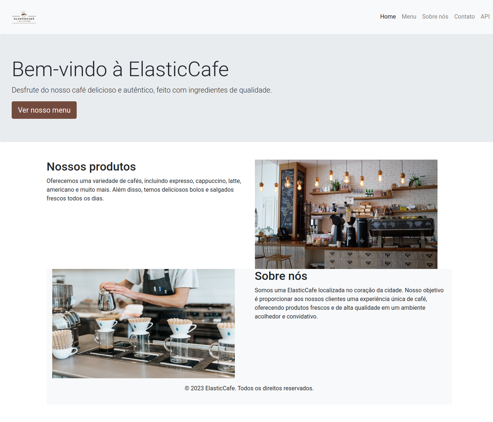

# ElasticCafé

ElasticCafé é uma aplicação de uma cafeteria que tem como objetivo ensinar a stack Elastic. Ela é implementada como uma REST API em Flask, com integração ao Elasticsearch e ao MongoDB.

A aplicação possui um frontend acessível na porta 80 do host com a seguinte interface:

